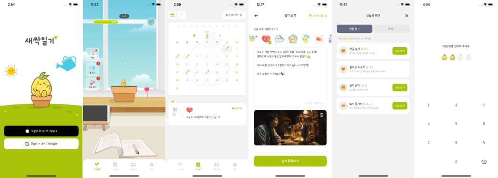

# 새싹일기 (FeedDiary) — React Native & Flutter

> **2024~2025년 직접 운영한** 일기 앱을 RN 0.85 + Flutter 두 스택으로 재구현한 모노레포. 하루의 감정을 기록하고, 매일 미션으로 식물을 키우고, 다른 사용자와 일기를 나누는 앱입니다.



<sub>※ 위 이미지와 [UI · 인터랙션 구현](#6-ui--인터랙션-구현) 섹션의 GIF 2개는 실제 서비스 당시 앱 화면입니다.</sub>

**▶︎ 라이브 데모** → [브라우저에서 바로 실행](https://choi12.github.io/feeddiary-rn-flutter/). Flutter 웹 빌드입니다. 설치·서버 설정 없이 로그인부터 일기·커뮤니티까지 데모 모드로 동작합니다.

- 🌱 **UI/UX 는 그대로 보존하고 내부 아키텍처만** 2026 기준으로 현대화했습니다. (2024~2025 운영 · App Store·Play Store 배포 · 가입자 300+명)
- 🔌 원본은 **자체 백엔드**로 운영하던 서비스였고, 운영 비용 때문에 서버를 종료한 뒤 지금은 **네트워크 경계에서 mock 어댑터로 가로채는 데모 모드**로 동작합니다. 키·서버 설정 없이 clone 후 바로 실행됩니다.
- ⚖️ 같은 앱을 Flutter 로도 만들어, 네트워크·캐시·낙관 업데이트·환경 분리를 **두 프레임워크가 어떻게 다르게 푸는지** 코드로 비교합니다.

RN 에서 React Query 가 맡아주던 **캐시 수명**이 Flutter 에서는 숙제로 남았습니다. *언제 낡았다고 볼지* 와 *언제 버릴지* 를 Riverpod 에는 구분할 장치가 없어 직접 만들어 붙였습니다.

막혔던 지점 세 곳입니다. [React Query 캐시 수명을 Riverpod 로 손수 조립](#2-서버-상태-캐시--변동-주체로-분류한-캐시-정책) · [무한리스트가 만든 낙관 업데이트 분기](#3-낙관적-업데이트--그리고-무한리스트가-만든-분기) · [Android 15 Edge-to-Edge 가 드러낸 iOS 전용 inset 계산](#운영하며-겪은-것-2024-25)

---

## 프로젝트 소개

새싹일기는 하루의 감정을 스티커·사진과 함께 기록하고, 매일 주어지는 미션(일기 쓰기·공개·댓글·좋아요)을 완료해 얻은 물주기·사랑주기 아이템으로 화분(식물)을 키우며, 다른 사용자와 일기를 공유하는 일기 앱입니다.

- **보존한 것**: 화면 구성, 디자인, 인터랙션, 화면 흐름 (실제 서비스 당시 그대로)
- **바꾼 것**: 내부를 RN 0.85 + React 19 기준으로 현대화했습니다. 새로 넣은 것은 zod 응답 검증·변환, 토큰의 Keychain 이전, React Compiler · `useOptimistic` · ErrorBoundary, Jest 테스트, 네트워크 경계의 mock 데모입니다. Zustand/React Query 분리 · 인터셉터 · 네이티브 flavor · `Update` 진입 분기는 원본 설계를 현재 기준으로 정비해 보존했습니다
- **Flutter 트랙**: 같은 앱을 포팅이 아니라 Flutter 관용대로 처음부터 재구현 (설계 차이는 비교 섹션에서). 기능 범위는 거의 겹치지만 아직 안 채운 자리는 비고의 데모 경계 목록에 적었습니다

## 운영하며 겪은 것 (2024-25)

2025년, 스토어에 나가 있던 앱을 **RN 0.72 에서 0.80 으로** 올렸습니다. 마이너 여덟 단계를 한 번에 건너뛰는 데다 React 18 → 19 전환까지 함께 걸려 있었고, 이미 쓰고 있는 사용자가 있어 깨뜨리지 않고 통과시켜야 했습니다. 정작 문제를 낸 건 그 전환 자체가 아니라 업그레이드에 딸려 온 두 가지, **targetSdk 상향(OS 쪽)과 Zustand 메이저 업(프레임워크 쪽)** 이었습니다.

- **Android 15 Edge-to-Edge 강제 적용**: 0.80 으로 올려 배포한 뒤, **앱 코드는 한 줄도 안 건드렸는데 기기가 Android 15 로 올라가면서** 바텀탭이 내비게이션 바와 겹쳐 터치가 막혔습니다. targetSdk 35 이상인 앱은 Android 15부터 Edge-to-Edge 가 강제돼 시스템이 자동 오프셋을 넣지 않습니다. 그 조건은 0.80 업그레이드가 만들었고(앱이 0.72 때 쓰던 targetSdk 34 를 그때 35 로 상향), **원인은 기존 코드 쪽**이었습니다. iOS 가 아니면 inset 계산 자체를 건너뛰고 있었습니다(`if (!isiOS) return defaultTabBarStyle`). iOS 는 노치 대응을 이미 하고 있었으니 Android 가 시스템 오프셋에 의존하던 동안에는 이 분기가 드러나지 않다가, 시스템이 오프셋을 빼는 순간 Android 만 남은 것입니다. 조기 반환을 걷어내고 Android 분기를 추가해, 바텀탭 높이와 패딩에 실측 safe-area inset(못 읽으면 상수 폴백)을 더하도록 고쳤습니다. 3버튼 내비게이션이 제스처보다 크기 때문에 상수로는 부족합니다.
- **Zustand v5 selector 무한 루프**: `The result of getSnapshot should be cached to avoid an infinite loop` 경고와 함께 `Maximum update depth exceeded` 크래시가 났습니다. 객체를 반환하는 selector 는 매 렌더마다 새 객체를 만드는데, React 19 이행과 함께 올린 **Zustand v5** 가 `useSyncExternalStore` 를 직접 쓰면서 `Object.is` 참조 비교에 항상 변경으로 걸린 게 원인이었습니다(React 19 자체가 아니라 그때 같이 올린 v5 쪽입니다). 해법은 selector 를 필드 단위로 쪼개 참조를 안정화하는 것이었습니다. 이 레포도 같은 규칙이고, 여러 값을 묶어야 하는 스토어 훅 5개만 `useShallow` 로 감싸 얕은 비교를 겁니다.

## 기술 스택

|             | React Native                                                                       | Flutter                                                       |
| ----------- | ---------------------------------------------------------------------------------- | ------------------------------------------------------------- |
| 버전        | RN 0.85.3 / React 19.2                                                             | Flutter 3.44 / Dart 3.12                                      |
| 상태관리    | Zustand 5 (세션·UI) + TanStack Query 5 (서버 조회)                                 | Riverpod 3 (코드젠 `@riverpod` · Notifier/Provider)           |
| 네트워크    | axios 1.x + 인터셉터(토큰·에러변환)                                                | Dio 5 + 인터셉터(토큰·로깅·에러변환)                          |
| 스키마 검증 | zod 4 (응답 런타임 검증 + 변환)                                                    | freezed 3 + json_serializable (`@JsonKey` snake↔camel)        |
| 라우팅      | React Navigation 7 (native-stack + bottom-tabs)                                    | GoRouter 17 (`AuthState` redirect)                            |
| 저장소      | MMKV(로컬 설정 · 잠금 비밀번호) + Keychain(토큰)                                   | flutter_secure_storage(토큰 · 잠금 비밀번호 · 잠금 사용 여부) |
| 인증        | Google/Apple OAuth + 자체 백엔드 토큰                                              | 동일 흐름 설계 (데모는 OAuth 우회 · 실 연동 후속)             |
| 빌드        | react-native-config + 네이티브 flavor(dev/prod)                                    | `--dart-define-from-file`(`config/*.json` · 컴파일타임 const) |
| 테스트      | Jest (스키마·에러 변환·스토리지 + 컴포넌트 렌더·훅·화면 스모크)                    | flutter_test (위젯·repository + golden)                       |

## 아키텍처

두 스택은 한 저장소의 형제 디렉토리로, 서로를 참조하지 않는 독립 앱입니다.

```
feeddiary-rn-flutter/
├── rn/          # React Native 0.85 앱
└── flutter/     # Flutter 3.44 앱
```

### React Native

도메인 API·전역 상태(`store`)·훅 같은 횡단 레이어 위에, 화면은 `index`·`hooks`·`components`(필요 시 `context`·`utils`)를 한곳에 두는 **피처 코로케이션**으로 구성합니다.

```
src/
├── api/               네트워크 레이어 (도메인별 함수 + zod 스키마)
│   ├── request.ts       axios 인스턴스 + 인터셉터 (HTTP → 도메인 에러)
│   ├── <domain>/        auth/diary/comment/community/flowerpot/letter/mission/user/etc
│   │   ├── APIxxx.ts     도메인별 단일 함수
│   │   └── types/        request / response / dto (도메인에 따라 일부만 · response·dto 는 zod — 원형 검증과 .transform() 변환 · request 만 타입)
│   └── mock/            axios-mock-adapter 데모 레이어 (USE_MOCK 토글)
├── store/             Zustand slices (modal / ui / user)
├── hooks/             core(navigation·context·공용 유틸) / features / store / prefetch / ui
├── components/        common / modal / lock / guard / controller ...
├── screens/           start/<Screen> · home/<area>/<Screen>/{index, hooks, components} (LockScreen 만 home 직하)
├── navigation/        Main(native-stack) + BottomTab
├── constants/         디자인 토큰·상수 (ui / api / auth / time / validation ...)
├── types/             도메인 에러 계층(errors.ts) 등 공용 타입
└── utils/             storage / config(query, sentry, app) / notifications ...
```

**앱 진입 흐름**: 진입점은 SignIn 이 아니라 `Update` 스크린입니다.

```
Update 스크린 (initialRouteName)
  └ useAppUpdate: 버전 체크
      ├ 업데이트 필요 → AlertModal
      ├ 선택 업데이트 → 모달을 닫으면 autoSignIn
      └ 최신     → autoSignIn (부팅 시 hydrate 된 토큰 캐시를 동기로 확인)
                    ├ 토큰 있음 → 잠금 사용 시 LockScreen, 아니면 BottomTab
                    └ 토큰 없음 → SignIn (폴백)
```

진입 분기를 단일 지점(`Update`)에 모아, 버전·인증·잠금 판단을 한 곳에서 순차 처리합니다.

색·간격·폰트는 `constants/ui` 디자인 토큰으로, 반복 UI 는 `components/common` 공통 컴포넌트로 단일화했습니다.

### Flutter

레이어드 골격(UI · domain · data)을 따르되, ViewModel 역할은 `ui/features` 안에 화면과 함께 둔 Riverpod Notifier/Controller 가 맡습니다 (domain 은 예외·모델만, use_case 는 단순 CRUD 라 생략 · 인증 오케스트레이션만 `routing/` 의 `AuthController` 에 있습니다). 화면 레이어를 피처별로 코로케이트하는 방식은 RN 과 같지만 골격은 다릅니다. RN 은 `domain` 층 없이 횡단 레이어(`api`/`store`/`hooks`) 위에 화면을 얹습니다.

```
lib/
├── config/      환경/상수 (app_config=dart-define · api_config · error_messages)
├── data/        models(freezed) · repositories(서버상태 provider) · services(dio_client·interceptors·token_storage)
├── domain/      exceptions(sealed AppException) · models
├── routing/     GoRouter + AuthState redirect
├── utils/       logger · cache_policy · pagination(제네릭 무한스크롤)
└── ui/
    ├── core/    theme(3-layer 디자인 토큰) · widgets(공통 chrome) · icons(FeedIcons)
    └── features/ auth · home · diary · community · flowerpot · letter · setting (화면 + 화면별 Notifier, home 은 BottomTab 셸)
```

**같은 진입 분기, 선언적 redirect**: RN 의 `Update` 화면에 대응하는 진입점은 `SplashScreen` 입니다. splash 가 `AuthController.restore()`(저장된 토큰으로 세션 복원)를 트리거하고, GoRouter 의 `redirect` 가 `AuthStatus`(`unknown` / `unauthenticated` / `authenticated`)를 보고 splash·signIn·home 으로 **선언적으로** 분기합니다. RN 이 `Update` 한 화면에 모았던 셋 중 **인증만** 이 redirect 가 선언적으로 받고, 잠금은 `MaterialApp.builder` 의 `LockGate` 오버레이가 따로 덮으며, 버전 게이트는 아직 자리가 없습니다.

**복귀할 때마다 다시 걸리는 잠금**: 잠금은 부팅 때 한 번이 아니라 앱이 백그라운드에서 돌아올 때마다 다시 걸리는데, 걸리는 지점이 다릅니다. RN 은 바텀탭 트리 안의 `LockScreenGuard` 가 `AppState` 전이를 보고 `LockScreen` 으로 `navigate` 하는 「또 하나의 화면」이고, Flutter 의 `LockGate` 는 `AppLifecycleListener(onResume)` 와 콜드스타트를 오버레이 하나로 합쳐 라우터 밖에서 Navigator 위를 덮습니다(뒤로가기 차단은 양쪽 다, Flutter 는 `PopScope(canPop: false)`).

## 핵심 구현 포인트

### 1. 네트워크 레이어 — 화면이 status code 를 모르게 하는 경계

`request.ts` 응답 인터셉터가 HTTP 상태를 **도메인 에러**로 사전 변환합니다 (타임아웃 → `TimeoutError` · 응답 없음 → `NetworkError` · 401 → `UnauthorizedError` · 409 → `ConflictError` · 그 외 → `APIError(status, message)`. 코드는 [비교 1](#1-네트워크--http-에러를-도메인-에러로-정규화)).

API 함수는 `formatAPIError(error, '로그인')` 로 **한국어 operation 라벨을 prepend** 하고, `UnauthorizedError` 등 흐름 분기가 필요한 에러만 명시적으로 re-throw 합니다.

응답은 **zod 스키마**로 런타임 검증과 동시에 snake_case → camelCase 변환합니다. (구버전의 수동 `toXxxDTO()` 를 전부 `Schema.transform()` 으로 통합)

```ts
// api/auth/types/dto.ts
export const UserDTOSchema = UserResponseSchema.transform(
  (u): UserDTO => ({
    userId: u.user_id,
    createdAt: u.created_time,
    fcmToken: u.fcm_token,
    // ...
  }),
);

// api/auth/APISignIn.ts
return UserDTOSchema.parse(response.data.resData!); // 검증 + 변환 한 번에
```

이렇게 하면 에러는 앱 내부 언어로 통일되고, 백엔드 계약(snake_case)이 화면 코드까지 새지 않으면서 **런타임 검증까지** 걸립니다.

같은 원칙을 서버 응답 밖에도 적용했습니다. 푸시 페이로드(`utils/notifications/displayNotification.ts`)도 `PushPayloadSchema` 로 `safeParse` 하고, 형태가 맞지 않으면 알림을 띄우지 않고 조용히 버립니다.

### 2. 인증 흐름 — 토큰은 Keychain 에, 읽기는 동기로

- OAuth(Google/Apple)로 사용자 식별자(UID)를 받아 자체 백엔드 `/auth/sign-in` 에 위임 → 자체 access token 발급
- 신규 사용자(`UnauthorizedError`) → `CreateProfile` 분기
- **토큰은 Keychain 에 저장** (원본은 토큰도 MMKV 에 뒀는데 현대화하며 옮겼습니다. 그 외 로컬 설정은 MMKV). 앱 부팅 시 in-memory 캐시로 hydrate 해서 인터셉터의 동기 접근(`getAccessToken()`)과 보안 저장을 양립
- **로그아웃 정리 오케스트레이션**(`useAuthCleanup`): Google 세션(로그인 type 이 `google` 일 때만) · FCM 토큰(데모는 스텁) · Keychain · MMKV · `queryClient.clear` · 네비게이션 reset 을 순차 정리.

```ts
// utils/storage/auth.ts — Keychain + in-memory 캐시
export const loadAccessToken = async () => { cached = (await Keychain.getGenericPassword(...))?.password ?? null; };
export const getAccessToken  = () => cached;            // sync (인터셉터용)
export const setAccessToken  = async (t) => { cached = t; await Keychain.setGenericPassword(...); };
```

### 3. 서버 상태 — 수명은 변동 주체로, 무효화는 중앙 맵으로

**React Query(서버 조회)** 와 **Zustand(세션·UI)** 를 분리하고, 캐시 정책을 _데이터의 변동 주체_ 로 3종 분류합니다(`utils/config/query.ts`). 기본은 staleTime 5분 · gcTime 30분 · retry 없음이고, 본인 액션으로만 변하는 데이터는 둘 다 Infinity, 타인 액션으로도 변하는 데이터는 staleTime 30초입니다 (Flutter 대응은 [비교 2](#2-서버-상태-캐시--변동-주체로-분류한-캐시-정책)).

무효화는 흩어 두지 않고 **중앙 맵**(`utils/query/invalidateQueries.ts`)에 모읍니다. `queryInvalidator.one/many`(many 는 predicate 기반) 위에 뮤테이션마다 무효화 대상을 명세하되 여러 키가 함께 움직이는 것은 `DIARIES_GROUP`/`MISSION_GROUP` 묶음으로 묶어, React Query 에서 가장 틀리기 쉬운 "무효화 그래프"를 단일 진실원천으로 둡니다.

좋아요·공개여부 토글은 낙관 갱신을 **`useOptimistic` + `useTransition`** 에 넘겼습니다 (동작·트레이드오프는 [비교 3. 낙관적 업데이트](#3-낙관적-업데이트--그리고-무한리스트가-만든-분기)).

### 4. 에러 처리 — 삼킬 실패와 알릴 실패를 장치로 가름

[네트워크 레이어](#1-네트워크-레이어--화면이-status-code-를-모르게-하는-경계)에서 도메인 에러로 정규화한 실패를, 화면이 일일이 처리하지 않도록 전역 피드백과 렌더 경계로 받습니다. 전역 피드백(`GlobalModals`)은 `App.tsx` 에서 **1회 마운트**하고 훅으로 어디서든 부르는데, `ErrorBoundary` 의 자식이 아니라 **형제로 두어** 렌더 에러로 트리가 폴백으로 바뀐 뒤에도 토스트·모달이 살아 있게 했습니다.

정책은 **실패를 화면에서 분기하지 않고 등급으로 가르는 것**입니다. 보고 창구는 `utils/error/reportError.ts`(`__DEV__` 콘솔 + `Sentry.captureException`) 하나로 모으고(`useErrorToast` 와 `ErrorBoundary`, 그리고 조회 실패는 `QueryCache` 의 `onError` 가 그걸 부릅니다), 등급 사이에서 **갈리는 건 사용자에게 보이는 표면뿐**입니다.

| 등급                      | 표면                         | 자리                                                    |
| ------------------------- | ---------------------------- | ------------------------------------------------------- |
| 회복 가능한 뮤테이션 실패 | 화면 유지 + 토스트           | 뮤테이션 훅 전반 (`useErrorToast`)                      |
| 조회 실패                 | 화면 대체 + 재시도           | 목록·상세 조회 화면 (`ErrorView` 의 `reload={refetch}`) |
| 사용자가 몰라도 되는 실패 | 표면 없음 — 보고만 하고 진행 | 버전 체크 요청 실패 · 초기 설정 · 백그라운드 푸시 등    |

셋째 등급이 이 분류를 제일 잘 보여 줍니다. `useAppUpdate` 의 버전 체크 요청이 실패했다고 사용자를 앱 밖에 세워 둘 이유는 없으므로, 보고만 남기고 그대로 로그인 흐름으로 넘깁니다.

```ts
// screens/start/Update/hooks/useAppUpdate.ts
} catch (error) {
  reportError(error);
  await autoSignIn();   // 진입은 막지 않는다
}
```

### 5. 테스트 — 단위·훅·스모크, 그리고 골든의 결정성

RN 은 Jest 로 검증합니다. 스키마 DTO 변환·거부 케이스 · 에러 변환 · Keychain 래퍼 같은 단위 테스트 위에 컴포넌트 렌더·훅·화면 스모크가 붙어 있고, 훅 테스트(`useCheckNickname`·`useDiaryDetails`·`useLikeDiary`)는 `queryWrapper` 로 React Query 를 실제로 래핑합니다.

Flutter 쪽은 **골든의 결정성**이 관건이었습니다. `test/flutter_test_config.dart` 의 `testExecutable` 이 번들 폰트를 `FontLoader` 로 먼저 등록하고(안 하면 Ahem 박스로 렌더돼 스냅샷이 무의미해집니다), 화면 골든은 데모 어댑터를 그대로 시드로 재사용하되 `DemoApiAdapter(latency: Duration.zero)` 로 인위 지연만 뺍니다. '나의 일기' 골든은 `await tester.pump(CachePolicy.standardGcTime + …)` 로 남은 타이머를 소진시켜야 통과합니다. [캐시 정책 비교](#2-서버-상태-캐시--변동-주체로-분류한-캐시-정책)에서 손수 조립한 `cacheFor` 폐기 타이머가 테스트에선 pending timer 로 잡히기 때문입니다.

```bash
(cd rn && yarn test)          # Jest
(cd flutter && flutter test)  # 위젯·repository + 골든
```

골든 PNG 는 이 저장소를 만든 머신에서 생성한 것이라 **다른 OS·CI 에서는 폰트 힌팅·플랫폼 렌더 차이로 픽셀 diff 가 날 수 있습니다** (로컬 비주얼 회귀 가드 용도이고 레포가 깨진 게 아닙니다). 의도한 UI 변경으로 깨졌다면 `flutter test --update-goldens test/golden/` 로 갱신합니다.

통합 레이어는 아직입니다. 다음은 mock 어댑터를 활용한 API 함수 통합 테스트입니다.

### 6. UI · 인터랙션 구현

정적 이미지로는 안 보이는 부분이라, 실제 서비스 당시 데모 영상을 첨부합니다.

|            나의 화분 · 미션과 성장             |              나의 일기 · 작성              |
| :--------------------------------------------: | :----------------------------------------: |
|  |  |

## RN ↔ Flutter 구현 비교

> 같은 문제를 각 생태계의 관용에 맞게 어떻게 풀었는지입니다(성능 측정 비교가 아닙니다). 상태를 무엇으로 가르느냐가 정해지면 캐시 수명도, 낙관 업데이트를 되돌리는 방식도 따라옵니다.

| 개념            | React Native                                                  | Flutter                                                                                   |
| --------------- | ------------------------------------------------------------- | ----------------------------------------------------------------------------------------- |
| 상태 분리       | *라이브러리*로 분리 (Zustand=세션·UI / React Query=서버 조회) | *수명 선언*으로 분리 (같은 Notifier 에 `keepAlive` / `cacheFor` 를 걸어 캐시 정책만 나눔) |
| 네트워크 경계   | axios 인터셉터에서 HTTP → 도메인 에러                         | Dio 인터셉터에서 `DioException` → `AppException`                                          |
| 응답 검증/변환  | zod `.transform()` (런타임 검증 + 매핑)                       | freezed `@JsonKey` + `fromJson` (코드젠 매핑 · 컴파일타임 타입)                           |
| 라우팅 분기     | `Update` 화면이 진입 분기를 순차 처리                         | GoRouter `redirect` 가 `AuthStatus` 로 선언적 분기                                        |
| 낙관적 업데이트 | `useOptimistic` + 자동 revert                                 | keepAlive provider override + 수동 revert                                                 |
| 토큰 저장       | Keychain + in-memory 캐시(sync)                               | flutter_secure_storage + in-memory 캐시(sync)                                             |
| 환경 분리       | `react-native-config` + **네이티브 flavor**                   | **`--dart-define-from-file`** 컴파일타임 const                                            |

### 1. 네트워크 — HTTP 에러를 도메인 에러로 정규화

두 스택 모두 **네트워크 경계 한 곳**에서 HTTP 실패를 도메인 에러로 바꿔, 화면이 status code 를 모르게 합니다.

```ts
// RN — api/request.ts (axios 응답 인터셉터)
if (error.code === 'ECONNABORTED') return Promise.reject(new TimeoutError(error));
if (!error.response)               return Promise.reject(new NetworkError(error));
switch (status) {
  case API_CONFIG.STATUS.UNAUTHORIZED: return Promise.reject(new UnauthorizedError(error));
  case API_CONFIG.STATUS.CONFLICT:     return Promise.reject(new ConflictError(error));
  default:                             return Promise.reject(new APIError(status, data?.message ?? ..., error));
}
```

```dart
// Flutter — data/services/dio_interceptors.dart (ErrorInterceptor)
AppException _fromStatus(DioException err) {
  final status = err.response?.statusCode ?? ApiConfig.serverError;
  return switch (status) {
    ApiConfig.unauthorized => UnauthorizedException(cause: err),
    ApiConfig.conflict     => ConflictException(cause: err),
    _ => ApiException(statusCode: status, message: _serverMessage(...) ?? ..., cause: err),
  };
}
```

패턴은 같고, 차이는 **에러를 어디에 싣는가**입니다. axios 는 도메인 에러 인스턴스를 그대로 `reject` 하지만, Dio 는 `ErrorInterceptorHandler` 가 `DioException` 만 받는 타입 제약 때문에 도메인 예외를 `DioException.error` 에 실어 보내고 repository 의 `guardApiCall` 이 언랩합니다. `guardApiCall` 은 `DioException` 이면 `.error` 를 꺼내고, `AppException` 은 그대로, 그 밖의 예외는 `ApiException` 으로 정규화하되, `UnauthorizedException` 만은 신규 유저 분기를 타입으로 식별해야 해서 operation 라벨 없이 그대로 통과시킵니다(RN 이 `APISignIn` 에서 `UnauthorizedError` 를 먼저 걸러내는 것과 같은 순서).

### 2. 서버 상태 캐시 — "변동 주체"로 분류한 캐시 정책

RN 은 React Query 의 `staleTime` / `gcTime` 을 **데이터가 누구의 액션으로 변하는지**로 3종 분류했습니다. Flutter 에서는 Riverpod 한 도구가 상태·DI·캐시 수명을 모두 맡는데 `gcTime` 내장이 없어, 같은 분류를 `keepAlive()` 링크와 타이머로 수동 조립했습니다.

```ts
// RN — utils/config/query.ts
INDEPENDENT_QUERY_CONFIG; // 본인 액션으로만 변함 → staleTime/gcTime Infinity
REALTIME_QUERY_CONFIG; // 타인 액션으로도 변함 → staleTime 30초
```

```dart
// Flutter — utils/cache_policy.dart (React Query gcTime 을 Riverpod 로 매핑)
extension CacheForRef on Ref {
  void cacheFor(Duration duration) {                      // = React Query gcTime
    final link = keepAlive();
    Timer? timer;
    onCancel(() => timer = Timer(duration, link.close));  // 구독이 끊기거나 멈춘 뒤 보존
    onResume(() => timer?.cancel());
    onDispose(() => timer?.cancel());
  }
}
// 독립 = keepAlive (애너테이션 또는 non-autoDispose provider) · 기본 = cacheFor(30분) · 실시간 = cacheFor(30초) — 구독 해제 후 그만큼 뒤 폐기
```

실시간 티어는 **축이 어긋납니다.** RN 의 실시간 프리셋은 `staleTime` 만 30초로 덮고 `gcTime` 은 건드리지 않는데, Riverpod 에는 `staleTime` 대응이 없습니다. 그래서 Flutter 는 **그 30초를 폐기 타이머 쪽에 걸었습니다**(`realtimeGcTime`). 일기 상세와 댓글은 구독이 끊기거나 멈추고 30초가 지나면 `keepAlive` 링크가 풀리고, 그 시점에 활성 리스너가 없으면(일시정지된 구독은 남아 있어도 활성으로 세지 않습니다) provider 가 폐기됩니다. 그래서 화면을 나갔다 30초 뒤에 다시 들어오면 **자동으로 다시 조회**되고, 그보다 빨리 되살려야 하는 자리는 뮤테이션 성공 직후가 덮습니다.

같은 30초지만 하나는 *언제 낡았다고 볼지*의 타이머이고 다른 하나는 *언제 버릴지*의 타이머입니다.

### 3. 낙관적 업데이트 — 그리고 무한리스트가 만든 분기

좋아요 토글은 RN 에서 `useOptimistic` + 실패 시 자동 revert 로 풀었습니다. Flutter 는 `useOptimistic` 이 없어 keepAlive provider 에 override 를 쌓고 직접 되돌립니다.

```ts
// RN — screens/home/myDiary/DiaryDetails/hooks/useLikeDiary.ts
const [optimisticDiary, toggleOptimisticLike] = useOptimistic(diary, (state) => ({
  ...state,
  isLike: !state.isLike,
  likeCount: state.isLike ? state.likeCount - 1 : state.likeCount + 1,
}));

startTransition(async () => {
  toggleOptimisticLike(null);                          // 낙관 flip
  try {
    await APILikeDiary({ diaryIdx: diary.idx });
    const refetched = invalidateQueries.likeDiary(queryClient, diary.idx);
    await refetched;                                   // 서버값은 재조회로 확정
  } catch (error) {
    handleErrorWithToast(error, ...);                  // revert 코드가 없다
  }
});
```

**RN 쪽 `catch` 에 revert 가 없는 게 핵심입니다.** `useOptimistic` 값은 transition 이 끝나면 base state(React Query 가 들고 있는 서버값)로 자동 복귀하므로 실패 처리가 토스트 한 줄로 끝나지만, 대신 낙관 갱신을 **반드시 transition 안에서** 해야 한다는 제약이 따라옵니다. 복귀 시점이 transition 종료라, 재조회를 기다리지 않으면 낙관값이 옛 서버값으로 한 번 깜빡입니다. 그래서 `invalidateQueries` 가 돌려주는 Promise 를 transition 안에서 `await` 합니다. Flutter 는 그 자동 복귀가 없어 `catch` 에서 직전 값을 손으로 되돌려야 하고, 그래서 "무엇이 직전 값인가"(override 인가 base 인가)를 코드가 스스로 알아야 합니다.

```dart
// Flutter — ui/features/community/diary_likes.dart (글로벌 좋아요 override)
state = {...state, idx: optimistic};                     // 낙관 flip
try {
  final result = await ref.read(diaryRepositoryProvider).likeDiary(diaryIdx: idx);
  state = {...state, idx: (isLike: result.isLike, likeCount: result.likeCount)}; // 서버값 보정
} catch (error, stackTrace) {
  AppLogger.error('좋아요 실패', error: error, stackTrace: stackTrace);
  state = {...state, idx: current};                      // 실패 → 토글 직전 값(override/base)으로 revert
  rethrow;
}
```

여기서 **두 스택이 갈린 진짜 이유**는 무한 리스트였습니다. RN 과 Flutter 모두 같은 offset(skip) 페이지네이션을 쓰지만, RN 의 React Query 는 `invalidate` 시 **이미 로드된 모든 페이지를 한꺼번에 재조회**해 누적·스크롤을 보존합니다. 반면 Riverpod 에는 그런 내장 동작이 없어, 이 프로젝트의 `OffsetPagination` 믹스인은 다중 페이지 재조회 수단을 갖지 않습니다(invalidate 하면 1페이지부터 다시 로드됩니다).

그래서 Flutter 에서는 invalidate 대신 **idx별 override 를 글로벌 provider 한 곳에 모아** 목록↔상세가 같은 소스를 구독하게 했습니다. 누적된 리스트와 스크롤을 보존하면서, RN 이 좋아요마다 커뮤니티 목록의 로드된 페이지를 전부 다시 받는 것과 달리 **목록 재조회 없이** 좋아요만 동기화됩니다.

물론 비용이 없는 건 아닙니다. 한 번 토글한 항목은 앱 세션이 끝날 때까지 타인발 좋아요 변화가 가려집니다.

### 4. 환경 분리 — 다른 도구, 다른 깊이

둘 다 dev/prod 를 나누지만 **나눈 깊이와 도구가 다릅니다**. RN 은 `react-native-config` + 네이티브 flavor 라 환경이 빌드 변형에 박혀 dev 가 `com.feeddiary.dev` 로 prod 와 **동시 설치**되고, Flutter 는 `--dart-define-from-file` 로 `config/dev.json` 을 컴파일타임 const(`AppConfig`)에 주입해 네이티브 flavor 없이 **단일 바이너리**에 값이 박히고 릴리스 빌드에서 죽은 분기가 **트리셰이킹**됩니다.

트레이드오프가 분명합니다. RN flavor 는 **dev/prod 동시 설치**와 네이티브 레벨 분리(앱 표시 이름 · 번들 ID)를 주는 대신 네이티브 설정이 무겁고, Flutter dart-define 은 **가볍고 const 트리셰이킹**이 되는 대신 같은 기기에 dev/prod 를 따로 깔려면 flavor 를 추가로 구성해야 합니다.

### 5. Flutter 에서 직접 만든 세 가지

RN 에서는 라이브러리나 언어가 대신 해 주던 것을 Flutter 에서는 직접 만들어야 했던 자리입니다.

- **제네릭 페이지네이션**: RN 의 `useInfiniteQuery` 에 해당하는 것이 Riverpod 에 없어, 믹스인 `OffsetPagination<T>`(`utils/pagination.dart`) 하나로 끝 감지 · 누적 · `loadMore` 부분 실패 처리(3페이지가 실패해도 1~2페이지는 남습니다)를 일기·커뮤니티·편지 세 목록이 공유합니다. 각 컨트롤러는 `build()` 와 `fetchPage` 만 얹고, 나머지는 고유 로직입니다(편지는 작성·삭제와 하루 한 통 게이팅, 커뮤니티는 정렬 watch).
- **정밀 리빌드**: 좋아요 글로벌 override 는 `LikeState` 를 `record` 로 둬 값으로 비교되게 하고, 각 카드가 `diaryLikesProvider.select((likes) => likes[idx])` 로 자기 idx 만 구독해 그 카드만 리빌드합니다. RN 은 좋아요마다 목록을 재조회하므로 대응하는 자리가 없습니다.
- **타입 안전 에러 계층**: `sealed AppException` 으로 계층을 닫아, switch 가 빠뜨린 경우를 컴파일러가 잡습니다. RN 의 `types/errors.ts` + `formatAPIError` 에 대응하되 재라벨 방식이 갈립니다. RN 은 원본 객체의 `message` 를 덮어쓰고 그대로 다시 던지는 가변 방식이고, Dart 는 예외를 불변으로 뒀으니 `withOperation` 이 같은 서브클래스의 새 인스턴스를 반환합니다.

## 회고

### 현대화하며 다시 본 것

옛 RN 앱을 현재 기준으로 다시 손대며 가장 크게 바뀐 건 **경계에서 무엇을 보장하느냐**였습니다. 예전 `toXxxDTO()` 수동 매퍼를 zod `.transform()` 으로 옮기며, 백엔드 계약이 바뀌면 화면이 아니라 네트워크 경계에서 먼저 깨지게 만들었습니다. 그게 디버깅 비용을 가장 크게 줄여 준 변화였습니다. 메모이제이션은 React Compiler 를 켰습니다.

### 데모 모드 — 네트워크 파이프라인을 살린 채 경계만 가로채기

원본은 이미지 업로드까지 직접 운영하던 **자체 AWS EC2 백엔드**로 서비스했고, 그 서버가 종료된 상황에서 가장 쉬운 길은 화면에 더미 데이터를 박는 것이었지만, 그러면 정작 시연 대상인 **인터셉터 · DTO 검증 · React Query** 경로가 전부 죽습니다. 그래서 mock 을 화면이 아니라 **axios 인스턴스 경계**에 붙였습니다(`axios-mock-adapter`). 덕분에 실제 네트워크 파이프라인이 살아 있는 채로, 요청만 경계에서 가로챕니다. mock 은 화면에 박아 둔 더미가 아니라 사용자·일기·댓글·좋아요·화분을 인메모리로 들고 변형하는 상태 보존 백엔드라, 데모에서 쓴 일기가 내 목록에 남고, 그 일기를 공개로 바꾸면 공유 피드에도 그대로 뜹니다.

여기서 의식적으로 한 선택은 **실패 시나리오를 일부러 주입**한 것입니다(제출 텍스트에 `#에러` 를 넣으면 mock 이 `500`). 정상 응답만 mock 하면 에러·로딩 UI 가 실제로 동작한다는 걸 못 보여주는데, 실패를 주입하니 도메인 에러 변환과 에러 상태 화면이 데모에서 그대로 시연됩니다. 일기 작성·수정은 한 걸음 더 갑니다. 제출 자체를 `500` 으로 떨어뜨리면서 **다음에 여는 일기 상세 조회 1회를 예약 실패**시켜, 토스트로 끝나는 실패와 화면 전체가 `ErrorView` 로 바뀌었다가 재시도로 복구되는 실패를 둘 다 보입니다. Flutter 의 `DemoApiAdapter` 도 같은 1회 예약 플래그를 따로 구현해 두 스택 데모가 같은 시나리오로 돕니다.

### 호환성 문제에서 내린 결정

원본 RN 앱을 RN 0.85 현행 스택으로 재구현했습니다. 그 과정에서 일부 네이티브 라이브러리가 이 빌드 환경과 마찰을 빚었고, 아래는 _데모 공개_ 라는 목표에 맞춰 무엇을 보존하고 무엇을 우회할지 경계를 정한 결정들입니다.

- **Firebase**: RN 0.85 + New Architecture 빌드에서 iOS 링키지 충돌(`FirebaseAuth-Swift.h not found`, [공식 저장소에도 보고된 이슈](https://github.com/invertase/react-native-firebase/issues/8271))을 냈고, 정적 프레임워크로 우회하자 React-Core 모듈 노출 문제로 옮겨갔습니다. 데모의 핵심은 mock 네트워크 경계였기에 **패키지를 제거**하고, 푸시 표시·라우팅 코드(`displayNotification`·`backgroundMessageHandler`·notifee 컨트롤러)는 `src/` 에 남긴 채 Firebase Auth 연동과 FCM 토큰 발급·삭제만 제거·스텁으로 대체했습니다.
- **fast-image → expo-image**: `react-native-fast-image` 는 React 19 와 peer 비호환이고 2022년 이후 릴리스가 없으며 New Architecture 도 미지원이라 현행 expo-image 로 일원화했습니다(`resizeMode → contentFit` 등 API 차이에 맞춰 전 화면 수정). 대가는 iOS 최소 버전입니다. expo-image 가 요구하는 Expo 56 이 iOS 16.4 를 요구해 RN 0.85 하한 15.1 보다 높아졌고, 원본 운영판이 지원하던 iOS 15.1~16.3 구간을 재구현은 지원하지 않습니다.

두 건 모두 데모를 지금 돌아가게 만드는 쪽을 택한 결과입니다.

### 같은 앱을 Flutter 로

두 번 만들며 가장 크게 남은 건 **RN 이 React Query 에 위임하던 것을 Flutter 에서 손으로 조립해 본 경험**입니다. 그걸 직접 만들어 보고 나서야 React Query 에 얼마나 많은 걸 맡기고 있었는지 실감했습니다.

---

## 실행 방법 (데모 모드)

> 인터셉터 · DTO 검증(zod) · React Query 캐시는 **전부 실제로 실행**되고, **네트워크 경계(axios 인스턴스)에서 요청만 mock 으로 가로챕니다**.
> `USE_MOCK=false` 로 두면 같은 코드가 실서버와 통신합니다 (공개 저장소의 `API_SERVER` 는 placeholder).

### React Native (`rn/`)

전제: Node **22.22.3**(저장소 루트 `.nvmrc`) · Yarn **3.6.4** Berry(`rn/package.json` 의 `packageManager` · 릴리스 바이너리는 `rn/.yarn/releases` 에 포함) · Ruby **3.2.6**(루트 `.ruby-version` · CocoaPods 는 `rn/Gemfile.lock` 이 1.15.2 로 고정). `.yarnrc.yml` 의 `yarnPath` 가 커밋된 Yarn 3 릴리스를 가리키므로 Yarn 1.22 이상이 깔려 있으면 `corepack enable` 없이도 위임됩니다. Ruby 는 `.ruby-version` 의 3.2.6 으로 검증했습니다.

```bash
cd rn
corepack enable   # packageManager 필드대로 Yarn 3 활성화
yarn install
bundle install && (cd ios && bundle exec pod install)   # iOS 만

# 데모(dev) 모드 — env/.env.development (USE_MOCK=true) 사용
yarn ios:dev        # 또는
yarn android:dev

# 실 서버(prod) 모드 — env/.env.production 직접 작성 필요 (gitignore · 원본 서버 종료로 구조 시연용)
yarn ios:prod       # 또는
yarn android:prod
```

별도 키·서버 없이 `yarn ios:dev` / `yarn android:dev` 만으로 데모가 실행됩니다. 화면 상단 빨간 배너(`DEMO · DEV · Mock 데이터로 시연 중`)로 mock 모드임을 표시합니다.

**데모 모드의 핵심**:

- mock 응답의 키를 **백엔드 원본 계약 그대로** 돌려줌 → DTO 변환이 실제로 동작 (대부분 snake_case 이고 `isLike`·`commentCount` 처럼 원본이 camelCase 인 필드는 그대로 둠)
- 일기·댓글·편지·신고 제출 텍스트에 `#에러` 를 포함하면 mock 이 `500` 을 반환해 **에러·로딩 UI 를 직접 확인 가능** (네 화면 모두 에러 토스트로 표시되고, 일기 작성/수정은 추가로 다음에 여는 일기 상세 조회 1회를 실패시켜 ErrorView → 재시도 복구까지 시연)
- OAuth(Google/Apple)는 mock 으로 못 잡으므로, `USE_MOCK=true` 일 때 **데모 우회 분기**로 즉시 로그인 진입 (실제 OAuth 흐름 코드는 보존)

### Flutter (`flutter/`)

전제: Flutter **3.44**(개발 버전) · 최소 Flutter **3.38.4** · Dart **3.12.0**(`flutter/pubspec.lock` 의 `sdks:`). 더 낮은 버전에서는 `flutter pub get` 이 SDK 버전 오류로 멈춥니다.

```bash
cd flutter
flutter pub get

# 데모(dev) 모드 — config/dev.json (USE_MOCK=true)
flutter run --dart-define-from-file=config/dev.json

# 웹 데모 — 시뮬레이터·서버 설정 없이 브라우저(Chrome)에서 바로
flutter run -d chrome --dart-define-from-file=config/dev.json

# 위 라이브 데모와 동일한 배포 빌드 (--base-href 를 빼면 에셋 경로가 전부 404)
flutter build web --dart-define-from-file=config/dev.json --base-href /feeddiary-rn-flutter/

# 실 서버(prod) 모드 — config/prod.json (gitignore · 원본 서버 종료로 구조 시연용)
# config/example.json 의 키를 복사한 뒤 USE_MOCK 을 false 로, API_SERVER 를 실제 주소로 바꿔 작성
flutter run --dart-define-from-file=config/prod.json
```

RN 의 `react-native-config`(env 파일)에 대응해 Flutter 는 **`--dart-define-from-file`** 로 환경을 주입합니다. 주입값은 전부 컴파일타임 const(`AppConfig`)라, 릴리스(AOT) 빌드에서는 쓰지 않는 분기가 트리셰이킹으로 제거됩니다. 또 `fromEnvironment` 기본값(`USE_MOCK` 은 `bool.fromEnvironment`)을 둬서, 인자 없이 `flutter test` 만 돌려도 동작합니다.

가로채는 방식은 RN 과 같습니다. 실제 네트워크 코드(Dio 인터셉터 · freezed DTO · Riverpod 캐시)는 살아 있고, **네트워크 경계(Dio `httpClientAdapter`)를 `DemoApiAdapter` 로 교체**해 인터셉터·DTO 를 그대로 둔 채 **요청만 경계에서 가로챕니다**. `#에러` 센티넬·약 600ms 지연·에러/로딩 시연 방식도 위 RN 데모와 같습니다.

다만 **mock 이 들고 있는 상태의 범위는 두 스택이 다릅니다.** Flutter `DemoApiAdapter` 는 편지 작성·삭제를 목록에 반영하고, 일기·좋아요·공개·댓글마다 미션 진행도를 올리고, 신고한 작성자를 커뮤니티 목록에서 빼고, 정렬 파라미터를 처리합니다. RN mock 은 이 네 가지가 고정 응답이라 화면은 뜨지만 값이 안 움직입니다(일기 작성·좋아요·공개 전환은 RN 도 상태를 반영합니다). 나중에 붙인 Flutter 쪽을 더 채운 결과입니다.

## 비고

- **데모 경계 — 의도적으로 비활성화/우회한 것** (설계·연동 코드는 소스로 보존):
  - FCM 푸시 · Firebase: 패키지 자체를 제거(푸시 표시·라우팅 코드는 `src/` 에 보존, Firebase Auth 연동과 FCM 토큰 발급·삭제는 제거·스텁)
  - 강제 업데이트: RN 은 게이트가 실제로 걸리지 않습니다(흐름 코드는 그대로 도는데 mock 이 현재 앱 버전과 같은 값을 돌려줘 항상 "최신" 으로 판정됩니다). Flutter 는 진입 게이트 자체가 없고 설정의 버전 화면만 있습니다
  - 일기 사진 업로드: Flutter 는 `createDiary`·`editDiary` 가 `image` 를 빈 값으로 보냅니다(프로필 사진은 정상 업로드)
  - Sentry: RN 은 연동 코드 완비·DSN 미설정으로 비활성, Flutter 는 DSN 자리만 (미연동)
  - OAuth(Google/Apple): 데모는 `USE_MOCK` 우회 진입 (Flutter prod 빌드의 OAuth 는 실서버 연동 시 구현되는 스텁)
  - iOS: 시뮬레이터 빌드까지 검증 (실기기 E2E 아님)
- **웹 데모 한정**: 시드의 외부 이미지(작성자 아바타 · 커뮤니티 일기 한 건의 본문 사진)는 CORS 헤더가 없어 웹에서는 로컬 캐릭터 이미지로 폴백하거나 접힙니다. 기능 차이는 없고 콘솔 경고만 남습니다.
- **AI 공저작**. 원본 새싹일기는 2024~25년 AI 없이 만들어 운영한 앱입니다. 이 재구현에서 무엇을 보존하고 무엇을 고칠지, 데모 범위를 어디까지 둘지, 두 스택을 같은 시나리오로 돌려 비교·검증하는 일과 최종 결정은 직접 맡았고, 설계 판단과 원인 진단은 Claude Code 와 함께 했으며, 코드 작성은 두 트랙 모두 Claude Code 가 했습니다. RN 은 원본 코드를 기준으로 다시 조립한 것이라 코드 전체를 읽고 이해하고 있고, Flutter 는 이 프로젝트로 본격 시작해 코드는 전부 읽고 검토했습니다. 재구현 커밋에는 `Co-Authored-By` trailer 를 남겼습니다.
- 라이선스: 코드는 루트 [`LICENSE`](LICENSE) (MIT). 폰트·아이콘·이미지·Lottie 에셋은 MIT 적용 대상이 아니며, 출처와 라이선스는 [`THIRD_PARTY_NOTICES.md`](THIRD_PARTY_NOTICES.md) 에 있습니다.
